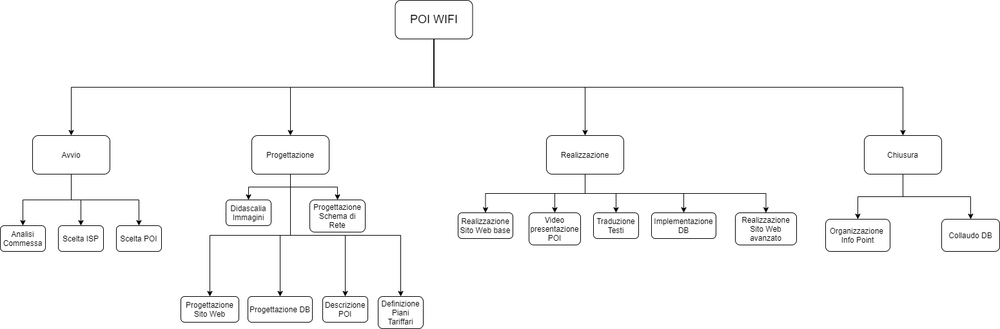

## RBS

(WBS)

q=numero persone/materiale

qh=quantità in ore[h]

pu=prezzo unitario in euro[e]

Giornata lavorativa di 8h

| ***Analisi Commessa***                  | 1.1                     | Totale: 120e       |
|:---------------------------------------:|:-----------------------:|:------------------:|
| Risorse umane                           | q=2; qh=4h; pu=15e      | 120e               |
| ***Scelta ISP***                        | **1.2**                 | **Totale: 60e**    |
| Risorse umane                           | q=1; qh=4; pu=15e       | 60e                |
| ***Scelta POI***                        | **1.3**                 | **Totale: 360e**   |
| Risorse umane                           | q=3; qh=8h; pu=15e      | 360e               |
| ***Didascalia Immagini***               | **2.1**                 | **Totale: 640e**   |
| Risorse umane:                          |                         |                    |
| Interni                                 | q=1; qh=16h; pu=15e     | 240e               |
| Consulente storico                      | q=1; qh=16h; pu=25e     | 400e               |
| ***Progettazione Sito Web***            | **2.2**                 | **Totale: 1280e**  |
| Risorse umane                           | q=2; qh=32h; pu=20e     | 1280e              |
| ***Progettazione DB***                  | **2.3**                 | **Totale: 960e**   |
| Risorse umane                           | q=2; qh=24h; pu=20e     | 960e               |
| ***Descrizione POI***                   | **2.4**                 | **Totale: 960e**   |
| Risorse umane:                          |                         |                    |
| Interni                                 | q=1; qh=24h; pu=15e     | 360e               |
| Consulente storico                      | q=1; qh=24h; pu=25e     | 600e               |
| ***Definizione piani tariffari***       | **2.5**                 | **Totale: 1040e**  |
| Risorse umane:                          |                         |                    |
| Interni                                 | q=1; qh=16h; pu=15e     | 240e               |
| Consulente finanziario                  | q=1; qh=16h; pu=50e     | 800e               |
| ***Progettazione schema di rete***      | **2.6**                 | **Totale: 1280e**  |
| Risorse umane                           | q=2; qh=32h; pu=20e     | 1280e              |
| ***Realizzazione Sito Web (base)***     | **3.1**                 | **Totale: 7400e**  |
| Risorse umane                           | q=4; qh=80h; pu=20e     | 6400e              |
| Materiali:                              |                         |                    |
| Server                                  | q=1; pu=1000e           | 1000e              |
| ***Video presentazione POI***           | **3.2**                 | **Totale: 960e**   |
| Risorse umane:                          |                         |                    |
| Interni                                 | q=1; qh=24h; pu=15e     | 360e               |
| Fotografo                               | q=1; qh=24h; pu=25e     | 600e               |
| ***Traduzione Testi***                  | **3.3**                 | **Totale: 720e**   |
| Risorse umane:                          |                         |                    |
| Interni                                 | q=1; qh=16h; pu=15e     | 240e               |
| Traduttore                              | q=1; qh=16h; pu=30e     | 480e               |
| ***Implementazione DB***                | **3.4**                 | **Totale: 640e**   |
| Risorse umane                           | q=2; qh=16h; pu=20e     | 640e               |
| ***Realizzazione Sito Web (avanzato)*** | **3.5**                 | **Totale: 4480e**  |
| Risorse umane                           | q=4; qh=56h; pu=20e     | 4480e              |
| ***Organizzazione Info Point***         | **4.1**                 | **Totale: 17190e** |
| Risorse umane                           | q=3; qh=32h; pu=15e     | 1440e              |
| Materiali:                              |                         |                    |
| Stand                                   | q=5; pu=150e            | 750e               |
| Tablet                                  | q=75; pu=200e           | 15000e             |
| ***Collaudo DB***                       | **4.2**                 | **Totale: 640e**   |
| Risorse umane                           | q=2; qh=16h; pu=20e     | 640e               |
|                                         | ***Spese Complessive*** | **38.730e**        |

Sommando i totali delle spese di ogni attività si ottiene una spesa complessiva per l'intero progetto di euro 38.730.

A tali spese deve essere aggiunto il costo annuo per il dominio associato al sito web stimato di 15 euro/anno.
